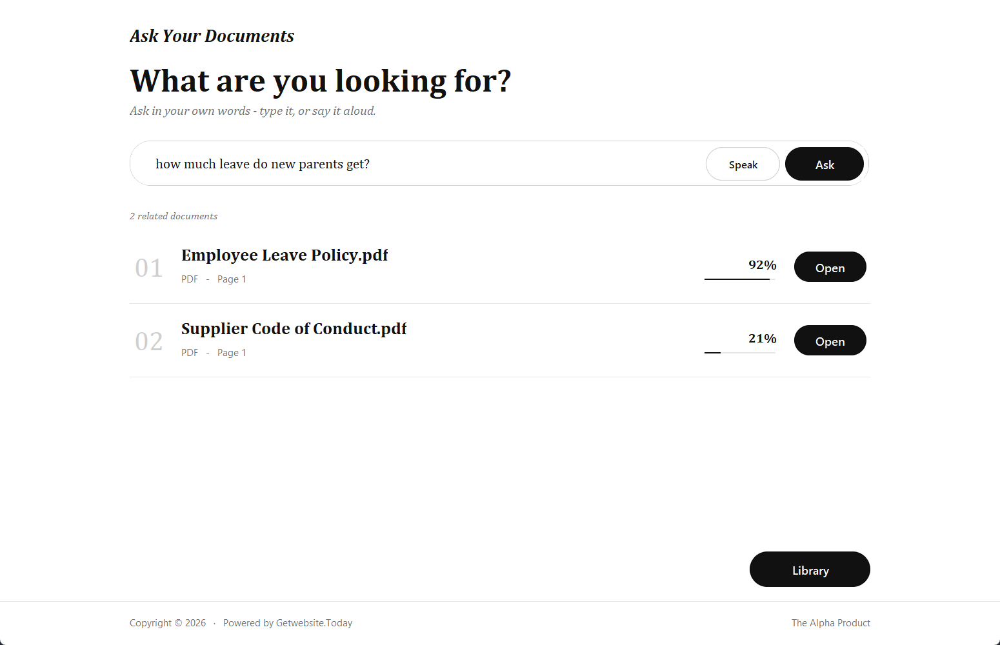
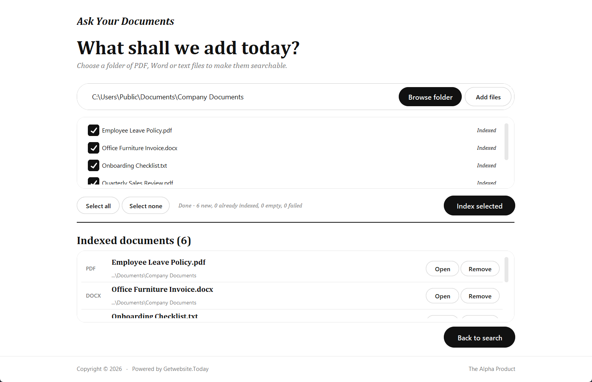

<div align="center">

# Ask Your Documents

**Stop hunting for files. Just ask.**

Search your own PDF, Word and text files by meaning - by typing or by speaking.
Private. Offline. Instant.

[](https://github.com/shahulmoonx-star/ask-your-documents-app-release/releases/latest/download/AskYourDocuments-Setup.exe)

[](https://github.com/shahulmoonx-star/ask-your-documents-app-release/releases/latest)


</div>

---

## Overview

You have hundreds of documents. You remember **what** you are looking for, but not **which file** it is in.

**Ask Your Documents** is a Windows app that fixes this. Add a folder once, then ask in plain words:

> *"How much leave do new parents get?"*
> *"How long do refunds take?"*
> *"1200 usd"*

It shows the documents that answer your question, best match first, with the page number and a button to open the file.

<p align="center">
  
</p>

---

## The idea

Three simple beliefs shaped this app.

### 1. Ask, don't hunt
- Search should work like talking to a colleague.
- You should not need to remember file names, folders or exact words.
- The app understands **meaning**, and it also respects **exact words and numbers**.

### 2. Your documents stay yours
- Everything runs on your own computer.
- Nothing is uploaded. No account. No internet needed.
- Even the language models are packed inside the installer.

### 3. Calm on purpose
- A quiet black-and-white interface with clear type and no clutter.
- One main action on each screen.
- It should feel like a tool you can trust, not an app asking for attention.

---

## What you can do

| | |
|---|---|
| **Search by meaning** | "Time off for new parents" finds a policy that says "26 weeks of maternity leave". |
| **Search by exact words** | Names, codes and numbers like `INV-2043` or `1200 usd` are matched exactly. |
| **Speak your question** | Click **Speak**, talk for 5 seconds, and it searches what you said. |
| **Add a whole folder** | PDF, Word (`.docx`), text and Markdown files, including sub-folders. |
| **See why it matched** | Every result shows the file, the page and a match percentage. |
| **Open instantly** | One click opens the file in its normal program. |
| **No duplicates** | The same content is never added twice. |
| **Stay in control** | Remove any document from the library at any time. Your files are never changed or deleted. |

---

## How it works

```
  ONCE                                         EVERY TIME YOU ASK
  ----                                         ------------------
  Your folder                                  Your question
      |                                         (typed or spoken)
      v                                               |
  Read the text of every file                         v
      |                                        Understand its meaning
      v                                               |
  Cut it into small pieces                            v
      |                                        Compare with every piece:
      v                                        meaning + exact words
  Turn each piece into numbers                        |
  that describe its meaning                           v
      |                                        Rank the documents
      v                                               |
  Save them on your computer  ------------------>     v
                                               Best matches first
```

In short: the app builds a private, searchable index of your documents on your PC, then
compares your question against it.

<p align="center">
  
</p>

---

## Install

1. Open the [latest release](https://github.com/shahulmoonx-star/ask-your-documents-app-release/releases/latest).
2. Download **AskYourDocuments-Setup.exe**.
3. Run it.
   - If Windows shows **"Windows protected your PC"**, click **More info**, then **Run anyway**.
   - No administrator password is needed.
4. Finish the wizard, then open **Ask Your Documents** from the Start menu.
5. Click **Library**, choose your folder, and click **Index selected**.
6. Go back to search and ask your first question.

### System requirements

| | |
|---|---|
| Operating system | Windows 11 (tested). Windows 10, 64-bit, should also work. |
| Disk space | About 500 MB for the app, plus space for your index |
| Memory | 4 GB or more recommended |
| Microphone | Only needed for voice questions |
| Internet | Not needed |

### Update
Download the newest installer and run it. Your library is kept.

### Uninstall
**Settings > Apps > Installed apps > Ask Your Documents > Uninstall.**
You are asked whether to also delete your library index. Your own documents are never touched.

### Verify your download (optional)
Each release includes `SHA256SUMS.txt`. In PowerShell:

```powershell
Get-FileHash .\AskYourDocuments-Setup.exe -Algorithm SHA256
```

The result should match the file.

---

## Your privacy

- **No internet connection** is used while you search or index.
- **No data leaves your computer** - no uploads, no tracking, no accounts.
- The index is one file in your user profile: `%LOCALAPPDATA%\AskYourDocuments`.
- Deleting that folder removes everything the app has stored.

---

## Good to know

- Works with **PDF, Word (.docx), text and Markdown** files.
- **Scanned PDFs** (pictures of pages) have no text to read, so they cannot be searched yet.
- Old Word `.doc` files should be saved as `.docx` first.
- Voice questions are **English** and last **5 seconds**.
- The app shows the matching **documents**; it does not write answers.

---

## Questions

**Is it really offline?**
Yes. Both models - one for understanding meaning, one for speech - are inside the installer.

**Does it change my files?**
No. It only reads them. "Remove" takes a document out of the search library; the file stays where it is.

**Why does Windows warn me when I run the installer?**
The installer is new and not yet code-signed, so Windows SmartScreen is cautious. Choose **More info > Run anyway**. You can check the SHA-256 checksum above.

**I edited a document. How do I update it?**
Remove the old entry in the Library, then add the file again.

**How many documents can it handle?**
It is built for personal and team libraries. In our tests a search took well under a second for about a thousand pages and about two seconds for several thousand pages.

---

## Support

For help, feedback or permission requests:

- **Email:** [connect@getwebsite.today](mailto:connect@getwebsite.today)
- **Phone:** +91 90426 42648

---

## Ownership and licence

**Ask Your Documents** is a product of **Getwebsite.Today**.

Copyright (c) 2026 Getwebsite.Today. All rights reserved.
The software is private and proprietary - see [LICENSE](LICENSE).
It includes open-source components that keep their own licences - see [THIRD_PARTY_NOTICES.md](THIRD_PARTY_NOTICES.md).
